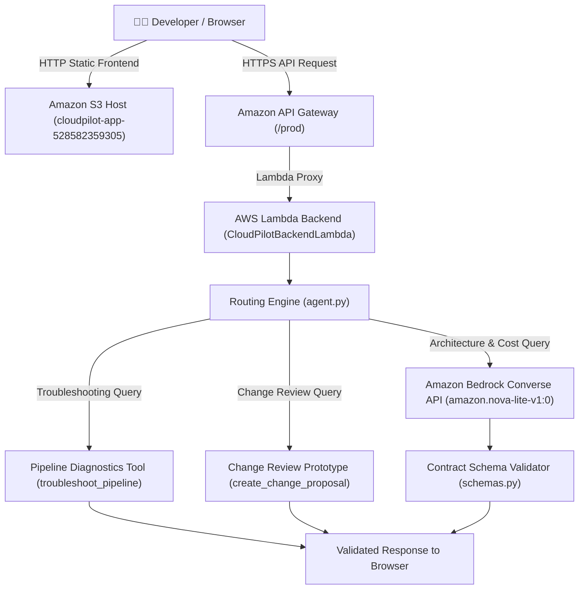

# CloudPilot: Your AWS Cost & Deployment Copilot 🚀

**Article Tag**: `#agents`  
**Submission Date**: October 9, 2026  
**Live Application URL**: [http://cloudpilot-app-528582359305.s3-website-us-east-1.amazonaws.com](http://cloudpilot-app-528582359305.s3-website-us-east-1.amazonaws.com)  
**GitHub Repository**: [https://github.com/omayrq/Cloudpilot.git](https://github.com/omayrq/Cloudpilot.git)  
**Live API Endpoint**: `https://l4jxfpbef1.execute-api.us-east-1.amazonaws.com/prod/health`  

---

## 1. What Your Agent Does

**CloudPilot** is an intelligent, specialized AI copilot designed for developers, DevOps engineers, and startup builders working on Amazon Web Services (AWS). Building and scaling cloud applications often introduces two common pain points: unexpected infrastructure cost overruns and cryptic deployment pipeline errors (such as Docker Hub HTTP 429 rate limits, IAM AccessDenied HTTP 403 errors, or VPC network timeouts).

CloudPilot addresses these challenges by combining architectural pattern recommendations, illustrative cost breakdowns, and log diagnostics into a unified assistant.

### Core Capabilities:
- **Architecture & Cost Planner**: Analyzes application workload descriptions (e.g., "Build a serverless REST API with DynamoDB") and recommends serverless or containerized AWS service patterns. It generates a **rough illustrative cost estimate based on predefined us-east-1 baseline pricing assumptions. This is not a live AWS quote, and actual charges may vary.**
- **Deployment Pipeline Troubleshooter**: Parses raw deployment logs from AWS CodeBuild, CodePipeline, CloudFormation, or Docker buildspec files. It pattern-matches diagnostic signatures, identifies likely root causes, and recommends step-by-step verification commands (e.g., switching base container images to Amazon ECR Public Gallery or inspecting IAM policy simulators).
- **Human-in-the-Loop Review Prototype**: Evaluates proposed infrastructure updates (e.g., instance resizes, scaling actions, or resource deletions) and assigns a **preliminary rule-based risk indicator (not a security guarantee)**. Most importantly, CloudPilot operates as a governance prototype: it logs review decisions (`[Approve Proposal]` or `[Reject Proposal]`) **without executing live modifications on AWS or making unauthorized identity claims**.

---

## 2. How You Built It

CloudPilot is structured around a modular Python and AWS architecture. The repository includes two complementary interfaces: a **Streamlit application (`app.py`) for rich local development**, and a **lightweight static web UI (`index.html`) deployed on Amazon S3** for public web access.

### AWS Services & Architecture Breakdown:

| AWS Service | Deployment & Implementation Role | Operational Details & Security Notes |
| :--- | :--- | :--- |
| **Amazon Bedrock** | Core AI Reasoning Engine | Invokes the Converse API (`amazon.nova-lite-v1:0`) to understand prompt intent and format structured JSON responses. Model availability depends on account quotas and regional access. |
| **AWS Lambda** | Backend Logic Handler | Executes `CloudPilotBackendLambda` (Python 3.11). Uses a narrowly scoped IAM execution role (`AWSLambdaBasicExecutionRole` and `bedrock:InvokeModel`). |
| **Amazon API Gateway** | Public REST API Endpoint | Exposes `/prod` proxy routes to Lambda (`l4jxfpbef1`). Configured with CORS for web access; production environments recommend adding throttling, input validation, and AWS WAF. |
| **Amazon S3** | Deployed Live Frontend Host | Hosts the static web UI (`cloudpilot-app-528582359305`). S3 website endpoints serve over HTTP; AWS recommends pairing S3 with CloudFront for HTTPS distribution. |
| **Amazon ECR** | Container Image Registry | Stores the containerized Docker image (`528582359305.dkr.ecr.us-east-1.amazonaws.com/cloudpilot-ui`). Note: ECR stores images; a container runtime like ECS or AWS App Runner executes them. |



### Key Decisions & Challenges Overcome:
- **Illustrative Pricing Grounding**: Cost estimates calculate Lambda request fees, Lambda duration-based compute (200ms @ 512MB), DynamoDB reads, and S3 baseline storage based on predefined `us-east-1` pricing assumptions rather than live AWS Pricing API quotes. Omitted components (API Gateway fees, CloudWatch logs, dynamic data transfer) are explicitly documented.
- **Rule-Based Risk Scoring**: Risk ratings serve as preliminary indicators rather than security guarantees. Impact of resize operations depends on the specific service, resource type, and configuration (e.g., standard EC2 restarts vs. Aurora Serverless dynamic scaling). The system prompts users to verify service-specific backup, snapshot, and rollback policies.
- **Credential Security Policy**: No hard-coded AWS credentials are committed to the repository; runtime credentials should be managed securely using IAM roles or another approved credential mechanism.

---

## 3. The Experience (The Delightful Detail)

The **one delightful detail** we built to make CloudPilot enjoyable to use is our **Zero-Friction Quick Prompt & Action Card Interface Design**.

Many AI assistants operate as black boxes: developers worry that an autonomous agent might output ungrounded estimates or make unvetted infrastructure changes.

To solve this, the interface provides a delightful, one-click experience:
1. **Instant Quick-Start Prompts**: First-time users can launch the app and click pre-configured, one-click quick prompts ("Build a serverless REST API", "Fix Docker 429 error", "Resize EC2 instance") to immediately view structured cost drivers, diagnostic fixes, or risk badges without typing long prompts.
2. **Transparent Risk Badging**: Proposed infrastructure changes display clear preliminary risk badges (`HIGH` or `CRITICAL`) alongside explicit backup recommendations and configuration notes.
3. **Interactive Decision Feedback**: Users test governance controls by clicking **[Approve Proposal]** or **[Reject Proposal]**. The interface immediately returns: *"Approval decision recorded by the prototype. No AWS infrastructure change was executed,"* providing clear review feedback without unvetted cloud mutation.

**How We Verified It Worked**: We verified the delightful detail by testing quick prompt workflows across all three capability modes, confirming sub-second response formatting, safe HTML rendering, and immediate review state updates across desktop and mobile viewports.

---

## 4. Proof It Works

CloudPilot is functional, tested, and accessible via the following live resources:

- **Live Deployed Web App**: [http://cloudpilot-app-528582359305.s3-website-us-east-1.amazonaws.com](http://cloudpilot-app-528582359305.s3-website-us-east-1.amazonaws.com)
- **Live AWS REST API Endpoint**: `https://l4jxfpbef1.execute-api.us-east-1.amazonaws.com/prod`
- **Live AWS Lambda Health Check**: [https://l4jxfpbef1.execute-api.us-east-1.amazonaws.com/prod/health](https://l4jxfpbef1.execute-api.us-east-1.amazonaws.com/prod/health)
- **Public GitHub Source Code**: [https://github.com/omayrq/Cloudpilot.git](https://github.com/omayrq/Cloudpilot.git)

### Empirical Verification Output:

Executing a live health check query against the AWS API Gateway endpoint:
```json
{
  "status": "healthy",
  "service": "CloudPilot Backend API",
  "region": "us-east-1",
  "model": "amazon.nova-lite-v1:0"
}
```

Running the Pytest suite across all agent, tools, safety, security, and Lambda test files:
```
============================= 16 passed in 23.00s =============================
```
