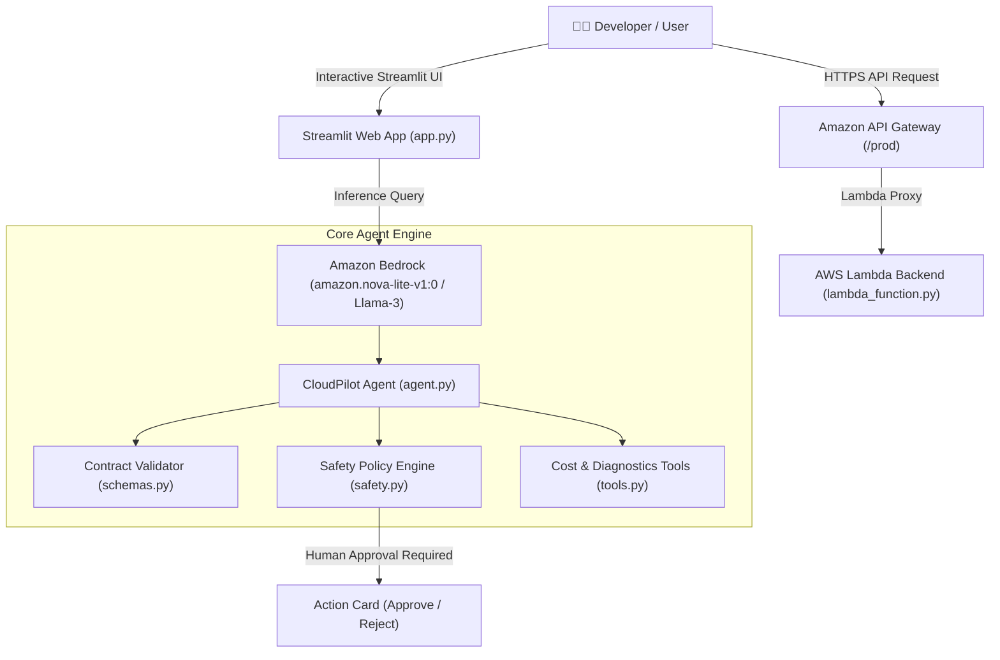

# CloudPilot — Your AWS Cost & Deployment Copilot 🚀

[](https://aws.amazon.com/bedrock/)
[](https://www.python.org/)
[](https://streamlit.io/)
[]()

**CloudPilot** is an intelligent AWS deployment copilot designed for developers, DevOps engineers, and startup builders. It assists in planning cost-effective cloud architectures, diagnosing CodeBuild/CodePipeline deployment failures, and evaluating infrastructure change risks through mandatory human-in-the-loop approval guardrails.

---

## 🌟 Core Features & Capability Modes

### 1. 🏗️ Architecture & Cost Planner
- Recommends serverless or containerized AWS service patterns based on user workload requirements.
- Estimates monthly operating costs grounded in AWS `us-east-1` base pricing models (Lambda, S3, DynamoDB, EC2, NAT Gateway, CloudFront).
- Highlights primary cost drivers, trade-offs, and optimization strategies (e.g. VPC Endpoints, Savings Plans, Spot instances).

### 2. 🔍 Deployment Pipeline Troubleshooter
- Parses raw deployment error logs from AWS CodeBuild, CodePipeline, Docker, or CloudFormation.
- Pattern-matches diagnostic signatures (e.g., HTTP 429 Docker rate limits, HTTP 403 IAM `AccessDenied`, VPC routing timeouts).
- Returns specific root cause analysis, evidence snippets, and actionable remediation commands.

### 3. 🛡️ Change Review & Safety Guardrail (Human-in-the-Loop)
- Evaluates proposed infrastructure modifications (e.g. instance resizes, resource deletions, scaling actions).
- Assigns deterministic risk severity (`LOW`, `MEDIUM`, `HIGH`, `CRITICAL`).
- **Safety Policy**: Enforces explicit human approval (`[Approve Proposal]` vs `[Reject Proposal]`) and **prevents unvetted autonomous execution against live AWS resources**.

---

## 📐 System Architecture



---

## 📁 Repository Structure

```
.
├── app.py                      # Interactive Streamlit UI web application
├── agent.py                    # Amazon Bedrock Converse API integration & routing logic
├── tools.py                    # Architecture planner, cost estimator & log troubleshooter
├── safety.py                   # Risk evaluation engine & human approval validator
├── schemas.py                  # Structured response contract schema & formatter
├── prompts.py                  # CloudPilot system prompt & persona definition
├── requirements.txt            # Python dependencies
├── .env.example                # Template for environment configuration
├── deployment/
│   ├── lambda_function.py      # AWS Lambda entry handler for REST API integration
│   └── deploy.ps1              # Automated PowerShell zero-secret deployment script
└── tests/
    ├── test_agent.py           # Unit tests for Bedrock agent routing
    ├── test_tools.py           # Unit tests for architecture & troubleshooting tools
    ├── test_safety.py          # Unit tests for human-in-the-loop safety guardrails
    └── test_lambda.py          # Unit tests for AWS Lambda handler
```

---

## 🚀 Quickstart & Local Setup

### 1. Prerequisites
- Python 3.10+
- AWS CLI configured (`aws configure`) with access to Amazon Bedrock (`bedrock:InvokeModel`)

### 2. Installation
```bash
git clone https://github.com/omayrq/Cloudpilot.git
cd Cloudpilot

# Create virtual environment
python -m venv .venv
source .venv/bin/activate  # On Windows: .venv\Scripts\Activate.ps1

# Install requirements
pip install -r requirements.txt
```

### 3. Environment Setup
Copy `.env.example` to `.env` and fill in your AWS region:
```env
AWS_DEFAULT_REGION=us-east-1
BEDROCK_MODEL_ID=amazon.nova-lite-v1:0
```

### 4. Run Pytest Test Suite
```bash
$env:PYTHONPATH="."
python -m pytest tests
```

### 5. Launch Local Web App
```bash
streamlit run app.py
```

---

## 🔒 Security & Secret Management Policy

- **Zero Hardcoded Credentials**: No AWS Access Key IDs or Secret Keys are committed to source control.
- Credentials are strictly resolved at runtime via environment variables (`AWS_ACCESS_KEY_ID`, `AWS_SECRET_ACCESS_KEY`) or IAM Execution Roles.
- `.gitignore` excludes `.env`, temporary archives, and build artifacts.

---

## 🏅 AWS Zero to Shipped Hackathon Alignment

1. **Live AWS Connection**: Connects to Amazon Bedrock Converse API and deploys via AWS Lambda & API Gateway.
2. **Cost Optimization**: Embedded pricing engine helps developers prevent unexpected AWS charges.
3. **Safety First**: Implements guardrail controls preventing AI agents from executing unverified cloud mutations.
