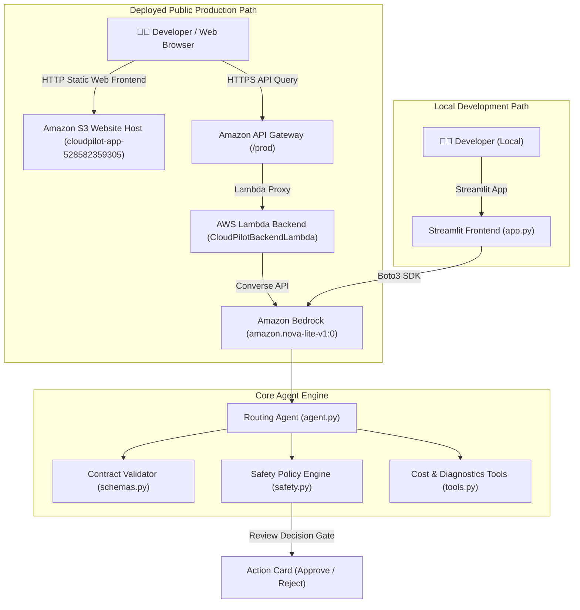

# CloudPilot — Your AWS Cost & Deployment Copilot 🚀

[](https://aws.amazon.com/bedrock/)
[](https://www.python.org/)
[](https://streamlit.io/)
[]()

**CloudPilot** is an intelligent AWS deployment copilot designed for developers, DevOps engineers, and startup builders. It assists in planning cost-effective cloud architectures, diagnosing CodeBuild/CodePipeline deployment failures, and evaluating infrastructure change risks through a human-in-the-loop review prototype.

---

## 🌟 Core Features & Capability Modes

### 1. 🏗️ Architecture & Cost Planner
- Recommends serverless or containerized AWS service patterns based on workload descriptions.
- Generates **rough illustrative cost estimates based on predefined `us-east-1` baseline pricing assumptions** (Lambda, S3, DynamoDB, EC2, NAT Gateway, CloudFront).
- Highlights primary cost drivers, trade-offs, and optimization strategies (e.g., VPC Gateway Endpoints, Savings Plans, Spot instances).
- Prompts users to verify final rates on official [AWS Pricing Pages](https://aws.amazon.com/pricing/).

### 2. 🔍 Deployment Pipeline Troubleshooter
- Parses raw deployment error logs from AWS CodeBuild, CodePipeline, Docker, or CloudFormation.
- Pattern-matches diagnostic signatures (e.g., HTTP 429 Docker rate limits, HTTP 403 IAM `AccessDenied`, VPC routing timeouts).
- Returns specific root cause analysis, evidence snippets, and actionable remediation commands.

### 3. 🛡️ Human-in-the-Loop Review Prototype
- Evaluates proposed infrastructure modifications (e.g. instance resizes, resource deletions, scaling actions).
- Assigns a **preliminary rule-based risk indicator** (`LOW`, `MEDIUM`, `HIGH`, `CRITICAL`).
- **Governance Gate**: Operates as a review prototype—logs human approval decisions (`[Approve Proposal]` vs `[Reject Proposal]`) **without executing live unvetted modifications on AWS or claiming IAM authorization**.

---

## 📐 System Architecture



---

## 📁 Repository Structure

```
.
├── app.py                      # Streamlit UI web application for local development
├── index.html                  # Lightweight static HTML web UI deployed on S3
├── agent.py                    # Amazon Bedrock Converse API integration & routing logic
├── tools.py                    # Architecture planner, cost estimator & log troubleshooter
├── safety.py                   # Risk evaluation engine & human approval validator prototype
├── schemas.py                  # Structured response contract schema & formatter
├── prompts.py                  # CloudPilot system prompt & persona definition
├── requirements.txt            # Python dependencies
├── Dockerfile                  # Container definition for App Runner / ECS execution
├── README.md                   # System documentation & setup instructions
├── AWS_BUILDER_CENTER_ARTICLE.md # Challenge article submission draft
├── deployment/
│   ├── lambda_function.py      # AWS Lambda entry handler for REST API integration
│   ├── deploy.ps1              # Automated PowerShell zero-secret backend deployment script
│   └── deploy-web-ui.ps1       # Automated S3 static website hosting deployment script
└── tests/
    ├── test_agent.py           # Unit tests for Bedrock agent routing
    ├── test_tools.py           # Unit tests for architecture & troubleshooting tools
    ├── test_safety.py          # Unit tests for human-in-the-loop review prototype
    └── test_lambda.py          # Unit tests for AWS Lambda handler
```

---

## 🚀 Quickstart & Local Setup

### 1. Prerequisites
- Python 3.10+
- AWS CLI configured (`aws configure`) with access to Amazon Bedrock (`bedrock:InvokeModel`)

### 2. Installation
```bash
git clone https://github.com/omayrq/Cloudpilot.git
cd Cloudpilot

# Create virtual environment
python -m venv .venv
source .venv/bin/activate  # On Windows: .venv\Scripts\Activate.ps1

# Install requirements
pip install -r requirements.txt
```

### 3. Run Pytest Test Suite
```bash
$env:PYTHONPATH="."
python -m pytest tests
```

### 4. Launch Local Web App (Streamlit)
```bash
streamlit run app.py
```

---

## 🌐 Live Deployed Endpoints

- **Live Deployed Web App**: [http://cloudpilot-app-528582359305.s3-website-us-east-1.amazonaws.com](http://cloudpilot-app-528582359305.s3-website-us-east-1.amazonaws.com)
- **Live AWS REST API Endpoint**: `https://l4jxfpbef1.execute-api.us-east-1.amazonaws.com/prod`
- **Live AWS Lambda Health Check**: [https://l4jxfpbef1.execute-api.us-east-1.amazonaws.com/prod/health](https://l4jxfpbef1.execute-api.us-east-1.amazonaws.com/prod/health)
